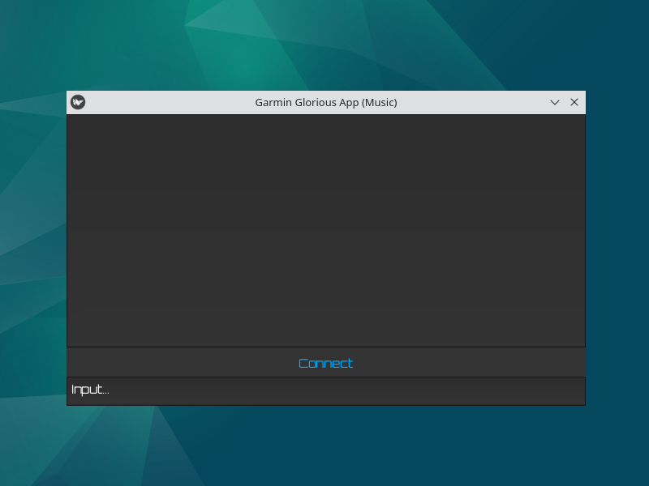

#### ⚠ Notes:
- Currently, the app can **NOT** modify playlists that are in the watch already (as the playlist files need to be inside the cache folder), make sure to keep and backup all playlist files that are inside the cache folder.

- Tested on Debian 12 (KDE), contribute to confirm working status on other systems.

#### ☰ Tasks:
- [ ] Android compatibility (via USB OTG)
- [ ] Get playlists or files (from watch instead of cache/temp)
- [ ] Options menu (for settings.py)
- [ ] Expand for podcasts, maps etc.

#### ✈︎ Installation (Source):
- `pip install -r requirements.txt`
- `pip install pymtp-gf-0.1.1.tar.gz`
- pymtp-gf: https://github.com/GloriousFusion/pymtp-gf/releases

#### ✈︎ Installation (Release):
- latest build: https://github.com/GloriousFusion/Garmin-Glorious-App/releases/tag/build

#### ⿻ Preview:

#### 🕮 Description:

- Add music and playlists without the use of garmin express, windows media player etc.

- Sync, add custom tracks, stack, name playlists in any way you want.

- Skip registrations, ads and proprietary systems (FUTO inspired).

#### ⚝ Credits:
- pymtp: https://github.com/eighthave/pymtp

- yt-dlp: https://github.com/yt-dlp/yt-dlp

- kivy: https://github.com/kivy/kivy

- orbitron font: https://github.com/theleagueof/orbitron

- open ai: [providing solid partner](https://openai.com/)
