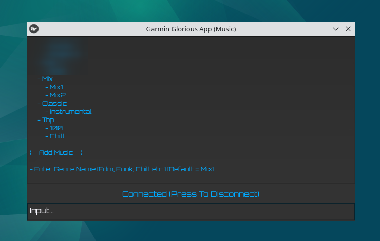

#### ⚠ Notes:
~~- Currently, the app can **NOT** get playlists that are in the watch (the playlist files are managed inside the cache folder), make sure to keep and backup all playlist files that are inside the cache folder, **if you want to add tracks into a playlist that is already in your watch (prior to using the app), simply transfer it into the cache folder**.~~
- ffmpeg is required (`sudo apt install ffmpeg`)

- Auto-sync is slow, can be disabled once playlists are in cache folder (recommended)

- Tested on Debian 12 (KDE)
  
- Tested on Linux Mint 22 (Xfce) [requires manual unmounting]

#### ☰ Tasks:
- [X] Get playlists or files from watch (removing the need to store playlists in cache folder)
- [X] Options menu (for settings.py)
- [ ] Android compatibility (via USB OTG)
- [ ] Expand for podcasts, maps etc.

#### ✈︎ Installation (Source):
- `pip install -r requirements.txt`
- `pip install pymtp-gf-0.1.1.tar.gz`
- pymtp-gf: https://github.com/GloriousFusion/pymtp-gf/releases

#### ✈︎ Installation (Release):
- latest build: https://github.com/GloriousFusion/Garmin-Glorious-App/releases/tag/build

#### ⿻ Preview:

#### 🕮 Description:

- Add music and playlists without the use of garmin express, windows media player etc.

- Sync, add custom tracks, stack, name playlists in any way you want.

- Skip registrations, ads and proprietary systems (FUTO inspired).

#### ⚝ Credits:
- pymtp: https://github.com/eighthave/pymtp

- yt-dlp: https://github.com/yt-dlp/yt-dlp

- kivy: https://github.com/kivy/kivy

- orbitron font: https://github.com/theleagueof/orbitron

- open ai: [providing solid partner](https://openai.com/)
